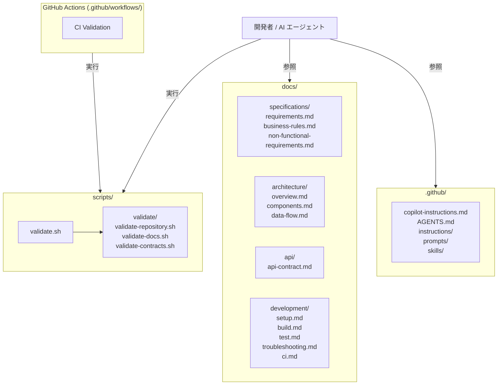

# Architecture Overview

## System Purpose

`ai-develop-template` は、GitHub Copilot などの AI エージェントを用いた開発を安定・再現可能にするためのテンプレートリポジトリである。

AI エージェントが仕様・アーキテクチャ・ルールを正しく理解した上で実装できるよう、Source of Truth ドキュメント・AI 向け指示ファイル・バリデーションスクリプトの構造を提供する。

## Architecture Style

ドキュメント中心型（Documentation-First）のテンプレートリポジトリ。

アプリケーションコードは持たず、以下で構成される。

- AI 向け指示・ルール（`.github/`）
- Source of Truth ドキュメント（`docs/`）
- バリデーションスクリプト（`scripts/`）

## Architecture Diagram



## Components

| Component | 場所 | 責務 |
|---|---|---|
| AI Instructions | `.github/copilot-instructions.md`, `AGENTS.md` | AI の基本行動方針・作業手順の定義 |
| Individual Rules | `.github/instructions/` | API・Architecture・Coding・Git・Testing の個別ルール |
| Prompts | `.github/prompts/` | AI が利用する再利用可能プロンプト |
| Skills | `.github/skills/` | AI が利用するスキル定義 |
| Specifications | `docs/specifications/` | 要件・ビジネスルール・非機能要件の Source of Truth |
| Architecture Docs | `docs/architecture/` | アーキテクチャ・コンポーネント・データフローの Source of Truth |
| API Contract | `docs/api/` | API Contract の Source of Truth |
| Development Docs | `docs/development/` | セットアップ・ビルド・テスト・トラブルシューティング手順 |
| Validation Scripts | `scripts/validate/` | リポジトリ・ドキュメント・Contract の自動検証 |

## Dependency Direction

```text
GitHub Actions CI
    ↓
scripts/validate.sh
    ↓
scripts/validate/validate-repository.sh
scripts/validate/validate-docs.sh
scripts/validate/validate-contracts.sh
    ↓
docs/ （検証対象）
.github/ （検証対象）
```

AI エージェントの参照順序：

```text
.github/copilot-instructions.md / AGENTS.md
    ↓
.github/instructions/
    ↓
docs/specifications/
    ↓
docs/architecture/
    ↓
docs/api/
    ↓
docs/development/
    ↓
既存コード・テスト
```

## Data Ownership

| データ | Owner |
|---|---|
| AI 行動ルール | `.github/copilot-instructions.md`, `AGENTS.md` |
| 機能要件 | `docs/specifications/requirements.md` |
| ビジネスルール | `docs/specifications/business-rules.md` |
| 非機能要件 | `docs/specifications/non-functional-requirements.md` |
| アーキテクチャ | `docs/architecture/overview.md` |
| コンポーネント責務 | `docs/architecture/components.md` |
| データフロー | `docs/architecture/data-flow.md` |
| API Contract | `docs/api/api-contract.md` |
| 開発手順 | `docs/development/` |

## External Systems

| システム | 用途 |
|---|---|
| GitHub Actions | CI での自動バリデーション実行 |
| GitHub Copilot | AI エージェントとしての実装支援 |

## Architectural Constraints

1. **アプリケーションコードを持たない**: このリポジトリはテンプレートであり、特定のアプリケーションコードを含まない。
2. **シェルスクリプトのみ**: バリデーションスクリプトは `bash` で実装し、外部ランタイム（Node.js・Python 等）への依存を避ける。
3. **ドキュメントファースト**: コードより先にドキュメントが存在すること。AI はドキュメントを Source of Truth として扱う。
4. **矛盾の禁止**: ドキュメント間・ドキュメントとコード間に矛盾がある場合、AI は独断で解消せず報告する。

## Architectural Decisions

### AD-001: ドキュメントを Source of Truth とする

**Decision:** AI エージェントは、実装コードよりもドキュメントを Source of Truth として優先参照する。

**Reason:** コードは実装詳細を含み、AI が意図しないパターンを学習するリスクがある。ドキュメントで意図を明示することで、AI の判断精度を向上させる。

---

### AD-002: バリデーションスクリプトを bash で実装する

**Decision:** `scripts/validate/` 内のスクリプトは bash で実装する。

**Reason:** 外部ランタイムへの依存を最小化し、CI・ローカル環境で追加セットアップなしに実行できるようにする。

---

### AD-003: 未確定事項を明示する

**Decision:** 仕様・アーキテクチャが未確定の場合は `TODO`、`TBD`、`OPEN` で明示する。

**Reason:** AI が推測で実装することを防ぎ、意思決定の所在を明確にする。

## Prohibited Patterns

- **AI が独断でアーキテクチャを変更すること**: 必ず確認を求める
- **AI が独断で API Contract を変更すること**: 必ず確認を求める
- **ドキュメントとコードの矛盾を AI が独断で解消すること**: 必ず矛盾を報告する
- **`TODO` を確定仕様として扱うこと**: 未確定事項は実装しない
- **スコープ外の機能・リファクタリングを無承認で追加すること**
- **外部ランタイムに依存するバリデーションスクリプトを追加すること**（bash 以外）
